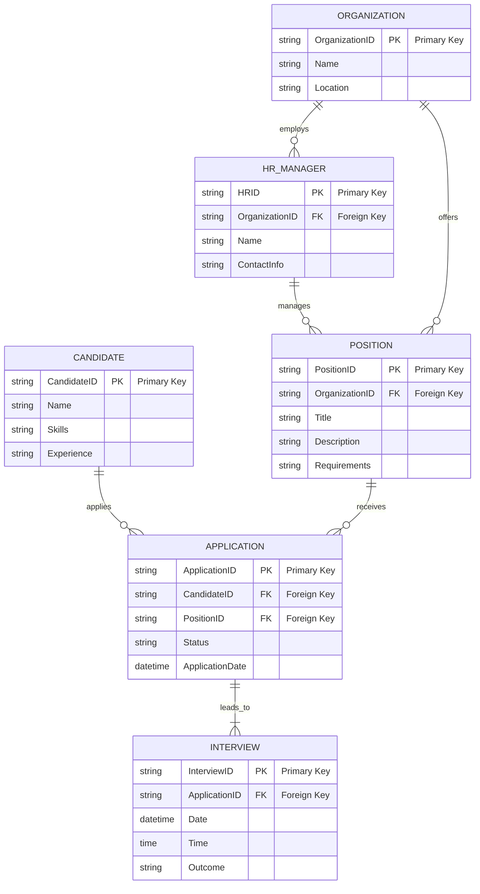

```mermaid

erDiagram
    CANDIDATE {
        string CandidateID PK "Primary Key"
        string Name
        string Skills
        string Experience
    }
    
    ORGANIZATION {
        string OrganizationID PK "Primary Key"
        string Name
        string Location
    }
    
    POSITION {
        string PositionID PK "Primary Key"
        string OrganizationID FK "Foreign Key"
        string Title
        string Description
        string Requirements
    }
    
    APPLICATION {
        string ApplicationID PK "Primary Key"
        string CandidateID FK "Foreign Key"
        string PositionID FK "Foreign Key"
        string Status
        datetime ApplicationDate
    }
    
    INTERVIEW {
        string InterviewID PK "Primary Key"
        string ApplicationID FK "Foreign Key"
        datetime Date
        time Time
        string Outcome
    }
    
    HR_MANAGER {
        string HRID PK "Primary Key"
        string OrganizationID FK "Foreign Key"
        string Name
        string ContactInfo
    }
    
    CANDIDATE ||--o{ APPLICATION : applies
    POSITION ||--o{ APPLICATION : receives
    APPLICATION ||--|{ INTERVIEW : leads_to
    HR_MANAGER ||--o{ POSITION : manages
    ORGANIZATION ||--o{ POSITION : offers
    ORGANIZATION ||--o{ HR_MANAGER : employs


```